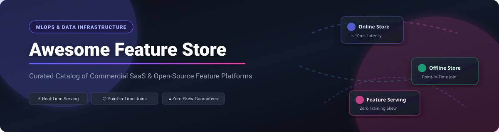

<div align="center">



# 🚀 Awesome Machine Learning Feature Store

### *Curated Directory of Commercial SaaS Platforms & Open-Source Feature Management Frameworks*

<p align="center">
  <a href="https://github.com/ishandutta2007/Awesome-Awesome-Awesome"></a><a href="https://discord.gg/jc4xtF58Ve"></a>
  
  
  
  <a href="https://github.com/ishandutta2007"></a>
</p>

---

</div>

## 📌 Executive Summary & Ecosystem Overview

This repository provides an authoritative, SEO-optimized, and regularly updated benchmark of **Machine Learning Feature Stores** — covering both commercial SaaS solutions and self-hosted open-source frameworks. 

Feature stores serve as the operational heart of modern **MLOps architecture**. They resolve critical machine learning operational challenges by:
- ⚡ **Eliminating Training-Serving Skew**: Guaranteeing identical feature computation logic across batch offline training and low-latency online inference.
- 🕒 **Ensuring Point-in-Time Correctness**: Executing precise `AS OF` historical joins to prevent future data leakage in training datasets.
- 🔄 **Enabling Feature Reuse & Discovery**: Centralizing feature definitions across data science teams to eliminate duplicate ETL pipelines.
- 🏎️ **Ultra-Low Latency Serving**: Serving feature vectors in sub-10ms via high-throughput online key-value databases.

---

## 📑 Table of Contents

- [📊 Sector Market Size & Dynamics](#-sector-market-size--dynamics)
- [🏢 SaaS & Hosted Commercial Platforms](#-saas--hosted-commercial-platforms)
- [🔓 Open-Source GitHub Projects](#-open-source-github-projects)
- [💡 Key Selection Criteria & Architectural Comparison](#-key-selection-criteria--architectural-comparison)
- [🤝 How to Contribute](#-how-to-contribute)
- [⚠️ Disclaimer](#%EF%B8%8F-disclaimer)
- [📈 Star History](#-star-history)
- [💖 Support & Community](#-support--community)

---

## 📊 Sector Market Size & Dynamics

> 💡 **Market Outlook**: The global **Machine Learning Feature Store & Feature Management Sector** is estimated at **~$1.2 Billion in 2024** and is projected to expand to **~$6.5 Billion by 2030** at a Compound Annual Growth Rate (CAGR) of **~32%**.
> 
> 🧩 **Market Fragmentation**: The sector is **moderately fragmented**. It features a competitive mix of hyper-scale cloud providers (AWS, Google Cloud, Databricks) offering embedded feature registries, alongside dedicated pure-play MLOps platform vendors (Tecton, Hopsworks, Qwak). The market exhibits strong co-existence between managed SaaS offerings and open-source foundation engines (Feast, Featureform).

---

## 🏢 SaaS & Hosted Commercial Platforms

The table below outlines leading commercial feature store platforms, sorted by **Company Size / Market Capitalization / Valuation (Descending)**.

| Product / Platform | Company Size / Valuation / Revenue | Starting Price | Free Tier / Trial Limit | Key Features & Best For |
| :--- | :--- | :--- | :--- | :--- |
| 🌐 **[Google Vertex AI Feature Store](https://cloud.google.com/vertex-ai/docs/featurestore)** | **$2.1 Trillion** Market Cap (Alphabet) / **$307B** Revenue | **$0.10** per 1M online reads + **$0.10/GB/month** columnar storage | **$300 free trial credits** valid for 90 days across GCP services | Managed feature serving integrated with BigQuery and Google Cloud MLOps ecosystem. Best for GCP-native workloads. |
| ☁️ **[Amazon SageMaker Feature Store](https://aws.amazon.com/sagemaker/feature-store/)** | **$1.9 Trillion** Market Cap (Amazon) / **$575B** Revenue | **$1.75** per 1M online read units & **$7.45** per 1M write units | **10 GB online** & **100 GB offline** storage free forever for new AWS accounts | Deep integration with S3, Glue, and SageMaker Pipelines. Online & offline dual store. Best for AWS-native ML teams. |
| 🧱 **[Databricks Feature Store](https://www.databricks.com/product/feature-store)** | **$43 Billion** Valuation / **$1.6B+** Annual Revenue | Billed at underlying DBU rate starting at **~$0.07/DBU-hour** | **14-day free trial** with full workspace access & compute credits | Built directly into Databricks Lakehouse with Unity Catalog governance and Delta Lake storage. Best for Spark-centric teams. |
| ⚡ **[Tecton](https://www.tecton.ai/)** | **$750 Million** Valuation / **$160M+** Total Funding | Consumption-based starting at **~$0.50/FCU hour** (~$500/mo base) | **14-day free sandbox trial** with up to 1M feature serving requests | Enterprise-grade feature platform created by Uber Michelangelo team. BYOC multi-cloud deployment. Best for enterprise scale. |
| 🐝 **[Hopsworks (Managed)](https://www.hopsworks.ai/)** | **$100 Million** Valuation / **$26M+** Total Funding | **$0.10** per serverless cluster hour or pay-as-you-go | **Free-forever developer sandbox** account on app.hopsworks.ai (up to 25 GB) | Real-time AI Lakehouse with Python-first feature store & multi-tenancy support. Best for modular MLOps stack. |
| 🛡️ **[Iguazio](https://www.iguazio.com/)** | Acquired by **McKinsey** ($50M+ Acq) / Parent **$15B+** Revenue | Enterprise nodes starting at **~$1,500/month** per cluster node | **14-day enterprise trial** sandbox access upon request | Integrated real-time MLOps platform with automated data pipelines & model monitoring. Best for enterprise data teams. |
| 🚀 **[Qwak](https://www.qwak.com/)** | **$50 Million** Valuation / **$27M+** Total Funding | **$0.25** per build hour & **$0.05** per instance hour | **14-day free trial** with 100 free execution credits | All-in-one MLOps platform bundling feature store, model build, deployment & monitoring. Best for rapid end-to-end ML. |
| ⚡ **[Molecula FeatureBase](https://www.molecula.com/)** | **$30 Million** Total Funding / **$5M+** Revenue | **$0.20** per query hour or standard cloud compute rates | **30-day free trial** with up to 100 GB data ingestion limit | Feature store powered by bitmap index technology for ultra-fast real-time analytics. Best for high-concurrency serving. |
| 📊 **[Rasgo](https://www.rasgo.ai/)** | **$20 Million** Total Funding / **$3M+** Revenue | Starter workspace plan from **$250/month** | **Free community tier** supporting up to 5 feature pipelines & 3 users | SQL-centric feature store allowing data engineers to transform data directly inside Snowflake/BigQuery. Best for SQL workflows. |

---

## 🔓 Open-Source GitHub Projects

Below is the list of top open-source feature stores and feature management frameworks, sorted by **GitHub Stars (Descending)**.

| Repository / Project | GitHub Star Badge | License | Core Capabilities & Description |
| :--- | :--- | :--- | :--- |
| 🍱 **[Feast](https://github.com/feast-dev/feast)** | [](https://github.com/feast-dev/feast/stargazers) | Apache-2.0 | **The leading open-source feature store**. Manages offline stores (Parquet, BigQuery, Snowflake), online stores (Redis, DynamoDB), point-in-time joins, and feature serving. |
| 📐 **[Featureform](https://github.com/featureform/featureform)** | [](https://github.com/featureform/featureform/stargazers) | Apache-2.0 | **The Virtual Feature Store**. Orchestrates existing infrastructure (Spark, Snowflake, Redis) via a declarative Python API without requiring data migration. |
| 🐝 **[Hopsworks](https://github.com/logicalclocks/hopsworks)** | [](https://github.com/logicalclocks/hopsworks/stargazers) | AGPL-3.0 | **Real-time AI Lakehouse with Feature Store**. Offers modular architecture, time-travel queries on Hudi/Iceberg tables, Python SDK, and fine-grained multi-tenancy. |
| ⏱️ **[Chronon](https://github.com/airbnb/chronon)** | [](https://github.com/airbnb/chronon/stargazers) | Apache-2.0 | **Airbnb's Feature Engineering Platform**. Built for real-time feature computation, point-in-time correctness, and seamless batch-to-streaming feature orchestration. |
| 🌊 **[Feathub](https://github.com/alibaba/feathub)** | [](https://github.com/alibaba/feathub/stargazers) | Apache-2.0 | **Alibaba's Stream-Batch Unified Feature Store**. Leverages Apache Flink for sub-second streaming feature computation and Apache Spark for offline throughput. |
| 🧈 **[Butterfree](https://github.com/quintoandar/butterfree)** | [](https://github.com/quintoandar/butterfree/stargazers) | Apache-2.0 | **Spark-based Feature Store Framework** created by QuintoAndar. Simplifies feature creation, inspection, loading into online/offline sinks, and historical dataset building. |
| 📖 **[MLFS Book Code](https://github.com/featurestorebook/mlfs-book)** | [](https://github.com/featurestorebook/mlfs-book/stargazers) | MIT | **Building ML Systems with Feature Stores**. Hands-on reference implementation code accompanying the O'Reilly book on feature engineering & MLOps architecture. |
| 🚀 **[Oomstore](https://github.com/oom-ai/oomstore)** | [](https://github.com/oom-ai/oomstore/stargazers) | MIT | **Lightweight & Fast Feature Store** implemented in Go & Rust. Designed for fast execution, low resource footprint, and easy embedding into microservices. |
| ☁️ **[Feast Azure](https://github.com/Azure/feast-azure)** | [](https://github.com/Azure/feast-azure/stargazers) | MIT | **Microsoft Azure Plugins for Feast**. Enables Azure Synapse, Azure Cosmos DB, and Azure Blob Storage as native backends for Feast deployments. |

---

## 💡 Key Selection Criteria & Architectural Comparison

When deciding between a commercial SaaS feature store and a self-hosted open-source framework, consider the following key trade-offs:

```
+-----------------------+----------------------------------+------------------------------------+
| Feature Category      | Commercial Managed SaaS          | Self-Hosted Open-Source            |
+-----------------------+----------------------------------+------------------------------------+
| Operational Overhead  | Zero infra maintenance           | High (K8s, Redis, Spark management)|
| Data Sovereignty      | BYOC / SaaS privacy compliance   | 100% On-Prem / VPC Sovereignty     |
| Cost at Scale         | Higher API/FCU costs at >2M users| Infrastructure & cloud storage only|
| Customizability       | Restricted to vendor APIs        | Fully pluggable & modular codebase |
| Time to Value         | Immediate setup & SLAs           | Requires internal platform engineering|
+-----------------------+----------------------------------+------------------------------------+
```

---

## 🤝 How to Contribute

Contributions are welcome! Please follow these simple steps:

1. 🔀 **Fork the repository**.
2. 📝 **Add or update entries** in `README.md` following the tabular formatting.
3. 🔎 **Provide accurate specifications**: Include platform name, live website link, exact pricing starting point, free tier details, and star badges.
4. 📬 **Open a Pull Request** with a concise summary of changes.

Check out our curated ecosystem index at [Awesome-Awesome-Awesome](https://github.com/ishandutta2007/Awesome-Awesome-Awesome).

---

## ⚠️ Disclaimer

- This catalog is a **community-curated index** for informational and research purposes only.
- Feature stores deal directly with core enterprise data pipelines and production ML models. Ensure proper authorization, access control, and security hardening before deploying in production environments.
- **Point-in-Time Correctness Warning**: Machine learning models trained on data without strict timestamp enforcement (`AS OF` joins) suffer from data leakage and degraded real-world performance.

---

## 📈 Star History

[](https://star-history.dera.page/#ishandutta2007/Awesome-Machine-Learning-Feature-Store&type=date&legend=top-left)

---

## 💖 Support & Community

Thank you for exploring **Awesome-Machine-Learning-Feature-Store**! If this repository has helped you evaluate, build, or deploy feature stores for your machine learning workflows, please consider supporting the project:

- ⭐ **Star this repository** to increase visibility for the MLOps community.
- 🔀 **Fork & Contribute** to keep the listings accurate and comprehensive.
- 📢 **Share with your network** on LinkedIn, X (Twitter), and Reddit.
- ☕ **Sponsor the Maintainer**: Support ongoing curation via the [GitHub Sponsors Dashboard](https://github.com/sponsors/ishandutta2007).

<p align="center">
  <sub>Made with ❤️ for ML Engineers, Data Platform Architects, and MLOps Specialists worldwide.</sub>
</p>
